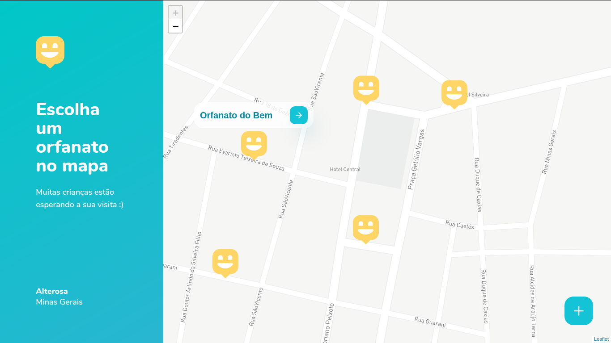
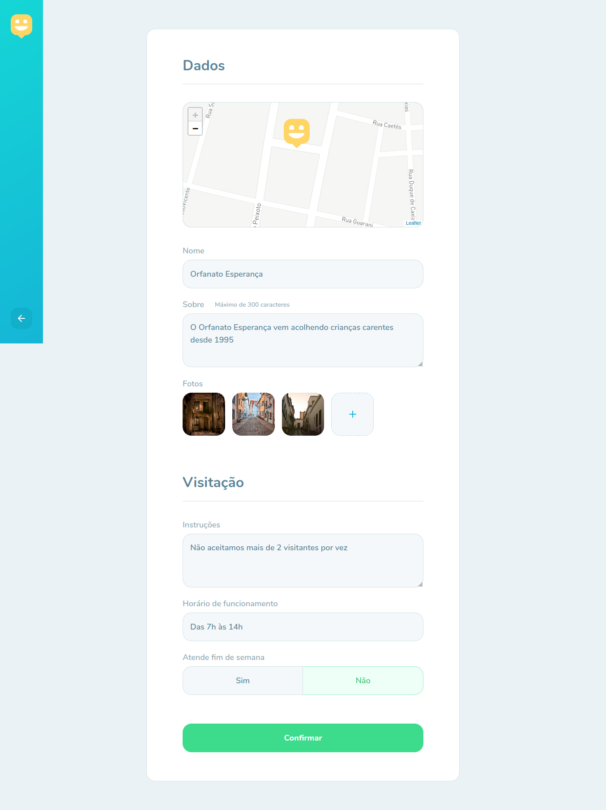
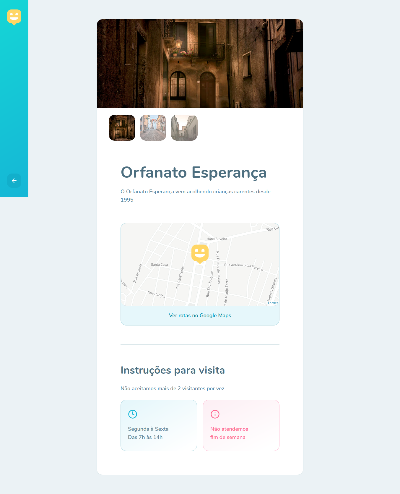
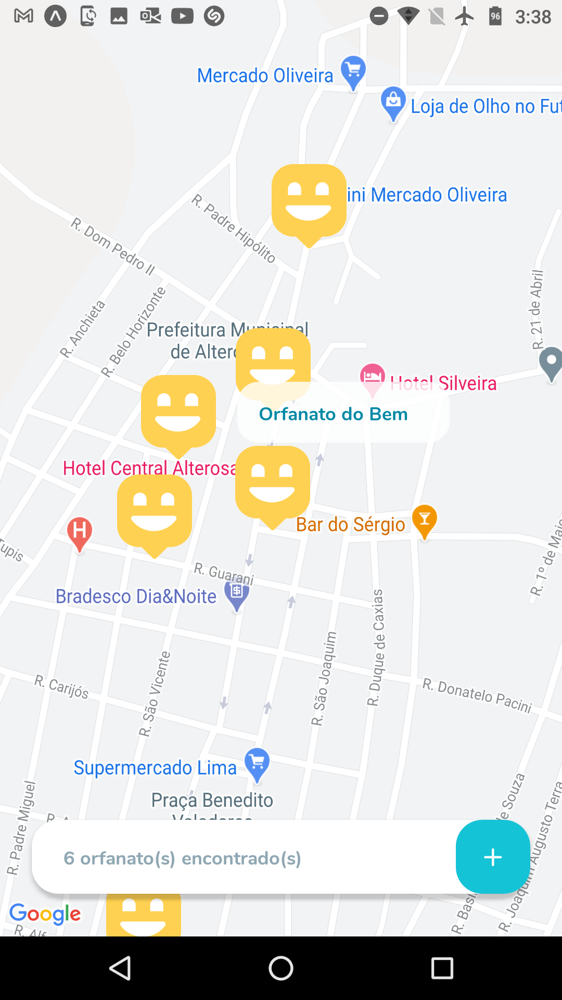
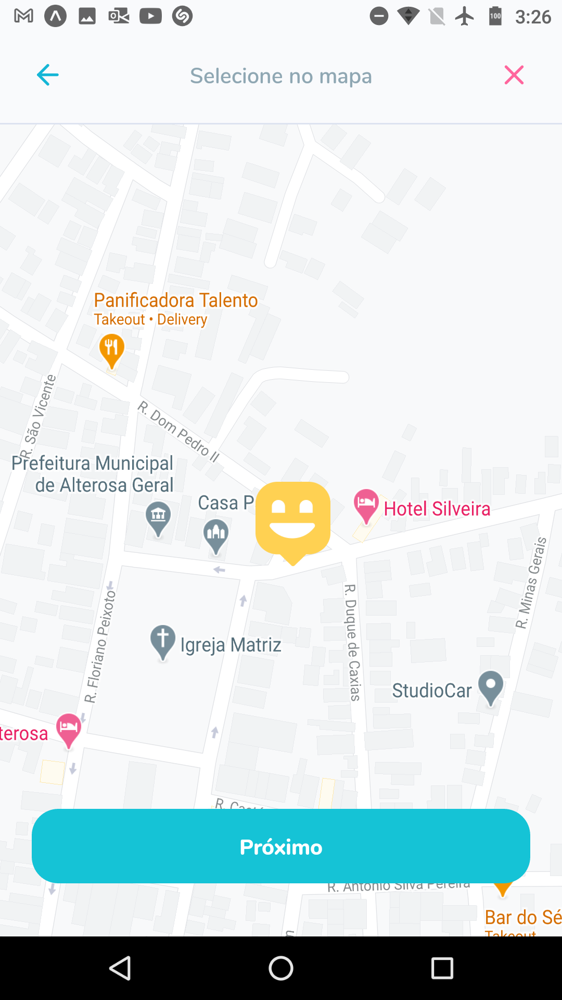

<h1
  style="color: #15C3D6;"
  align="center"
>
  🧒🏻️ Happy: Conectando heróis ❤️
</h1>

<h3
  style="color: #04B2C5;"
  align="center"
>
  Encontre um orfanato próximo, faça uma visita e torne-se o herói de uma criança!
</h3>

  Happy é uma plataforma cujo objetivo é mapear orfanatos, levando voluntários às crianças de forma descomplicada 😍️.

<h4>🛠️ Tecnologias e Ferramentas: 🛠️</h4>
<ul>
  <li>TypeScript</li>
  <li>Node.JS e TypeORM</li>
  <li>Multer</li>
  <li>Yup</li>
  <li>ReactJS</li>
  <li>React Native</li>
  <li>Expo CLI</li>
</ul>

<h4>📷️ Capturas de tela: 📷️</h4>
<table>
  <tr><td align="center"><strong>Aplicação Web</strong></td></tr>
  <tr>
    <td>
      
    </td>
  </tr>
  <tr>
    <td>
      
    </td>
  </tr>
  <tr>
    <td>
      
    </td>
  </tr>
  <tr>
    <td>
      
    </td>
  </tr>
</table>

<table>
  <tr><td colspan="2" align="center"><strong>Aplicação mobile</strong></td></tr>
  <tr>
    <td>
      
    </td>
    <td>
      
    </td>
  </tr>
  <tr>
    <td colspan="2">
      
    </td>
  </tr>
  <tr>
    <td colspan="2">
      
    </td>
  </tr>
</table>